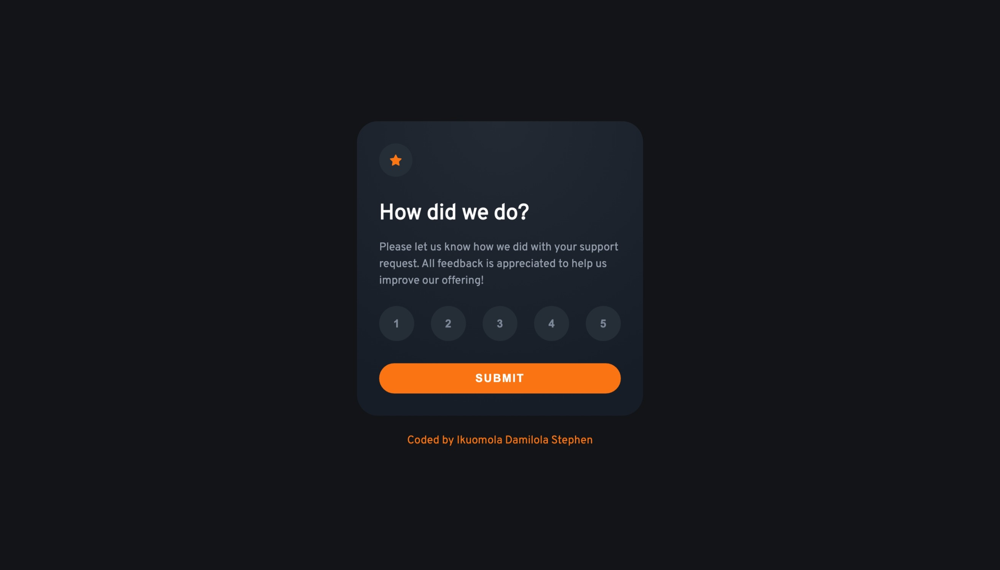
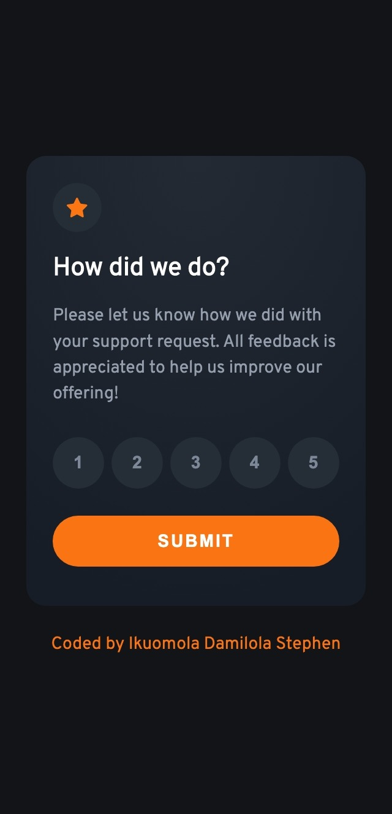

# Interactive Rating Component Docs

## Table Of Content

- **Overview**
    - User Stories
    - Features
    - Screenshots
- **Process**
    - Tools Used
    - Learning Curves
    - Continued Development
    - Resources
- **Acknowledgment**

## Overview

### User Stories

The user/users would be able to:

- View the optimal layout for the app depending on the their device screen size
- See the hover states for all interactive elements on the page
- Select and submit number ratings
- See the **“Thank you”** states after submitting a rating

### Features

- Different color state when the buttons are clicked
- Different color states and transition when the buttons are hovered

### Screenshots



Desktop View 1440px 



Mobile View 320px

## Process

### Tools used

- Semantic HTML5 markup
- CSS custom properties
- JavaScript
- Mobile-First workflow
- Parcel for bundling

### Learning Curves

This project was good enough as I just started some JavaScript and I decided to put them into practice as well doing more CSS. 

**Working with ES6 Classes**

For this project I implemented it using ES6 class which still behave like object constrcutors and its prototypes underhood. So we basically define a class and curly braces and the pass in the constructor inside the body of the class and them we use the `new` keyword to then calls the constructor thereby  creating  an object. See code snippet below. 

```jsx
class InteractiveRatingComponent {
	constructor () {}
}

const component = new InteractiveRatingComponent; 
```

Note: ES6 classes are not objects but they are blueprints/templates for creating new objects. 

**Selecting the HTML elements in the constrcutor**

After the creating the ES6 class then we have to define/select the HTML elements from the DOM and to this, I had to use **privates fields**. These private fields behave like properties that will on every single object/instance created from the Class. I also didnt want them to be accessible outside so I thought it would a good idea to use it. See code snippet below. 

```jsx
class InteractiveRatingComponent {
	#feedbackComponent = document.querySelector('.feedback__component');
	#gratitudeComponent = document.querySelector('.gratitude__component'); 
	#ratingButtonContainer = document.querySelector('.feedback__component-btns'); 
	#ratingButtons = document.querySelectorAll('.btn'); 
	#gratitudeRating = document.querySelector('.gratitude__component-message');

	constructor () {}
}

const component = new InteractiveRatingComponent();
```

**Creating the methods/handlers which will be passed in the addEventListener finctions**

Since Classes give use that ability to have methods in their body which will be in the prototype of the newly created object I made of them by creating two methods to implement the functionality of showing the **“Thank you”** card and for selecting a rating when the button is clicked. 

```jsx
class InteractiveRatingComponent {
	#feedbackComponent = document.querySelector('.feedback__component');
	#gratitudeComponent = document.querySelector('.gratitude__component'); 
	#ratingButtonContainer = document.querySelector('.feedback__component-btns'); 
	#ratingButtons = document.querySelectorAll('.btn'); 
	#gratitudeRating = document.querySelector('.gratitude__component-message');

	constructor () {

	}

	#submitRating(evtObj) {
			if(!evtObj.target.classList.contains('btn__submit') || !this.#gratitudeRating.firstElementChild.innerHTML) return; 
			evtObj.currentTarget.classList.add('hide'); 
			this.#gratitudeComponent.classList.remove('hide'); 
		}

	
	#selectRating(evtObj) {
			const clickedButton = evtObj.target.closest('.btn'); 
			if (!clickedButton) return; 
			for(let i = 0; i < this.#ratingButtons.length; i++) {
				this.#ratingButtons[i].classList.remove('btn__active'); 
			}
			clickedButton.classList.add('btn__active'); 
			this.#gratitudeRating.firstElementChild.innerHTML = clickedButton.firstElementChild.innerHTML
	}
}

const component = new InteractiveRatingComponent();
```

**How do I make use of the Private fields and Methods**

From the code above, the methods and fields which are private can not be used outside of class but we need still them. Remember, I said earlier that when the **new** keyword used and the constructor is called and a object is created and returned with the **`this`** keyword pointing to that newly created object. 

In order to make the method and field which we want private to have effect outside together, we need to attach the `addEventListener` function to the necessary private fields/properties/elements inside the constructor and then pass in the methods as event handlers which are callback functions. The other thing we should not forget is to use the **this** inside of the constructor since its points to the object. 

```jsx
class InteractiveRatingComponent {
	#feedbackComponent = document.querySelector('.feedback__component');
	#gratitudeComponent = document.querySelector('.gratitude__component'); 
	#ratingButtonContainer = document.querySelector('.feedback__component-btns'); 
	#ratingButtons = document.querySelectorAll('.btn'); 
	#gratitudeRating = document.querySelector('.gratitude__component-message');

	constructor () {
		this.#feedbackComponent.addEventListener('click', this.#submitRating.bind(this)); 
		this.#ratingButtonContainer.addEventListener('click', this.#selectRating.bind(this));
	}

	#submitRating(evtObj) {
			if(!evtObj.target.classList.contains('btn__submit') || !this.#gratitudeRating.firstElementChild.innerHTML) return; 
			evtObj.currentTarget.classList.add('hide'); 
			this.#gratitudeComponent.classList.remove('hide'); 
		}

	
	#selectRating(evtObj) {
			const clickedButton = evtObj.target.closest('.btn'); 
			if (!clickedButton) return; 
			for(let i = 0; i < this.#ratingButtons.length; i++) {
				this.#ratingButtons[i].classList.remove('btn__active'); 
			}
			clickedButton.classList.add('btn__active'); 
			this.#gratitudeRating.firstElementChild.innerHTML = clickedButton.firstElementChild.innerHTML
	}
}

const component = new InteractiveRatingComponent();
```

Also dont forget that if the event handler has a **this** key word inside it points/references the elements which the eventListener is attached to. So we need a way to still have the callback but manually set the this to the newly created object hence we use the `bind()` method and pass in **`this`** which is the newly created object. 

**Working with Events**

I learnt about `eventListeners`, `eventHandlers`, the event object (`event`, `e` or `evtObj`) which gets passed into the handlers to provide some extra features and information when passed into the handler. 

I worked on how to listen for event when it called whenever the user performs action, in the case of this small project,  it was a `“click”` event that was listened for on two case. Which are; 

- When the user clicks the submit button to see the **“Thank you”** state.
- When the user clicks on each of the rating button to do the rating.

I also got work with the event handlers which we registered as a callback function into the `addEvenlistener()` function and is called when the event happens. The addEventListener higher order functions was attached to a parent  `<div>`  of all the elements which is a class of `.feeback__component` and its child element with a class of .`feedback__component-btns`

```html
<div class = "feedback__component container__component ">
        <figure class = " flex star-icon__container">
          
        </figure>
        <h2 class = "feedback__component-header">How did we do?</h2>
        <p  class = "feedback__component-content">Please let us know how we did with your support request. All feedback is appreciated to help us improve our offering!</p>
        <div class = "flex feedback__component-btns"> 
          <button aria-label = '1' class = "btn"><span>1</span></button>
          <button aria-label = '2' class = "btn"><span>2</span></button>
          <button aria-label = '3' class = "btn"><span>3</span></button>
          <button aria-label = '4' class = "btn"><span>4</span></button>
          <button aria-label = '5' class = "btn"><span>5</span></button> 
        </div>
        <button class = "btn__submit">Submit</button>
</div>
```

This was done as I want to take advantage of `event propagation` which is very useful to know as it helps prevents attaching many event Listeners to many elements. 

```jsx
class InteractiveRatingComponent {
	#feedbackComponent = document.querySelector('.feedback__component');
	#ratingButtonContainer = document.querySelector('.feedback__component-btns');

	constructor () {
		this.#feedbackComponent.addEventListener('click', this.#submitRating.bind(this));
	}

	// Handling the submit button 
	#submitRating(evtObj) {
			if(!evtObj.target.classList.contains('btn__submit') || !this.#gratitudeRating.firstElementChild.innerHTML) return; 
			evtObj.currentTarget.classList.add('hide'); 
			this.#gratitudeComponent.classList.remove('hide'); 
	}

	//Handling the buttons.	
	#selectRating(evtObj) {
			const clickedButton = evtObj.target.closest('.btn'); 
			if (!clickedButton) return; 
			for(let i = 0; i < this.#ratingButtons.length; i++) {
				this.#ratingButtons[i].classList.remove('btn__active'); 
			}
			clickedButton.classList.add('btn__active'); 
			this.#gratitudeRating.firstElementChild.innerHTML = clickedButton.firstElementChild.innerHTML
		}
}
```

Inside the the eventhandler functions an eventObject (evtObj) is passed in and then we attached the **target** property to it (`evtobj.target`) logging it to the console returns the element that triggers the event i.e the element which was clicked in the case. However there is also a **currentTarget** property which can be attached to the event Object when needed (`evtObj.currentTarget`). Logging it to the console returns the element which the eventListener is attached to. 

**Creatng the Handler for the Submit Button** 

```jsx
class InteractiveRatingComponent{
	#gratitudeComponent = document.querySelector('.gratitude__component'); 

	constructor() {
		this.#feedbackComponent.addEventListener('click', this.#submitRating.bind(this))
	}

	#submitRating(evtObj) {
		if(!evtObj.target.classList.contains('btn__submit') || !this.#gratitudeRating.firstElementChild.innerHTML) return; 
		evtObj.currentTarget.classList.add('hide'); 
		this.#gratitudeComponent.classList.remove('hide'); 
	}
}
```

- When the event object is passed in we have to check if the element that triggers the event contains the class for the submit button **OR** if the `this.#gratitudeRating.firstElementChild.innerHTML` is **falsy** and if it does not nothing should happen.
- In the case that happens, we want to add the `hide` class to the parent element of the submit button element which is the element that the eventListener is attached to and we make use of the currentTarget property in the event object.
- Finally we have to remove that hide class already existing on the “Thank you” to display the feeback.

**Creatng the Handler for the Ratings Buttons**

To handle this we need to select the parent element that contains all the buttons and then create a callback function that will be called when the event is triggered but what triggers the event ?  

```jsx
class InteractiveRatingComponent{
	#ratingButtonContainer = document.querySelector('.feedback__component-btns'); 
	#ratingButtons = document.querySelectorAll('.btn'); 
	#gratitudeRating = document.querySelector('.gratitude__component-message');

	constructor() {
		this.#ratingButtonContainer.addEventListener('click', this.#selectRating.bind(this));
	}

	#selectRating(evtObj) {
			const clickedButton = evtObj.target.closest('.btn'); 
			if (!clickedButton) return; 
			for(let i = 0; i < this.#ratingButtons.length; i++) {
				this.#ratingButtons[i].classList.remove('btn__active'); 
			}
			clickedButton.classList.add('btn__active'); 
			this.#gratitudeRating.firstElementChild.innerHTML = clickedButton.firstElementChild.innerHTML
	}
}
```

- When event Object is passed in we use the target property to get the element we wish the to trigger the event.
- The element has be button. However the button has a `span` tag which even when clicked we want it to still trigger the event.
- So we have identified that the element we want to click is the button event if by chance the `span` tag is clicked on. So we need to do some traversing and search up the DOM to pick the closest element with the `.btn` class which are the rating buttons. So we use the closest method `closest()`. Doing this means that even if the user click the span and does not click the button the even still gets triggerd and returns the button element.
- Assuming we click outside the button for any reason then `null` will be returned as the button element was not found. So a condition is needed that says in the case `null` is returned nothing should happen. So we return using a guard clause.
- Next step is we have to loop over the all the buttons and remove the **active class** when the user clicks the buttons. Doing this means that each time the user clicks a button we remove the active class on the former button clicked.
- Then we then add the active class on the clicked button. If we don’t do this prior step each time a button is clicked, the active class will be added to all the buttons and we will never know which was is really active.
- The last step is to do another DOM walk. We need to find a way to read the numbers on the button on the on the message that we get from the “Thank You” card. So we select that message move down to the child element node using the `firstElementChild` property which return `<span></span>` and then use the innerHTML to get access to the content in the element. We then assign the chaining of those properties to the each button’s `firstElementChild` which returns a node and we get as to the content in the element using the innerHTML property as well.
- Each time a different button is clicked we need different ratings out of 5 depending in the clicked button.

### Continued Development

While I am happy with my solution on this project, I do accept that to some it might feel to much and they might be simopler was of doing this which is do agree. I am also happy that I got to use and test my little understanding of ES6 classes and how they are just synthatic sugar over constructor functions/object constrcutors. 

I also used ES6 classes because I didnt want to exposed my data to the global scope and I like the idea of having my functionality and data wrapped into one blocked. 

I am also open to as many corrections as possible an better ways of approaching smaller projects like this. 

### Resources

- [CodeSmith](https://www.youtube.com/watch?v=aAAS9cEuFYI) - To learn about constructor functions, object prototypes and the `new` keyword I recommend watching this video.
- [Udemy](https://www.udemy.com/course/the-complete-javascript-course/learn/lecture/22649535?start=90#questions) - To learn more about OOP in general I also recommend watching the video.
- [Mozilla Developer Network(MDN)](https://developer.mozilla.org/en-US/docs/Learn/JavaScript/Building_blocks/Events#event_delegation) - For a deeper dive into handling of events, event bubbling and delegation and the event object.
- [w3schools](https://www.w3schools.com/js/js_this.asp) - To learn about how the **`this`** keyword word in JavaScript and how its reference changes depending on where it used.
- [w3schools](https://www.w3schools.com/jsref/prop_element_firstelementchild.asp) - To learn more on the difference between firstElementChild and firstChild
- [w3chools](https://www.w3schools.com/js/js_if_else.asp) - To lean more about how to make condtional statements
- [w3schools](https://www.w3schools.com/js/js_loop_for.asp) - To learn more on how to use loops.
- [Mozilla Dveloper Networks(MDN)](https://developer.mozilla.org/en-US/docs/Web/CSS/gradient/radial-gradient) - A deep dive into radial-gradients

## Acknowledgment

I want to acknowledge FrontEndMentor for this providing this challenge which will enable me test my understanding of JavaScript after just learning some basic concepts.